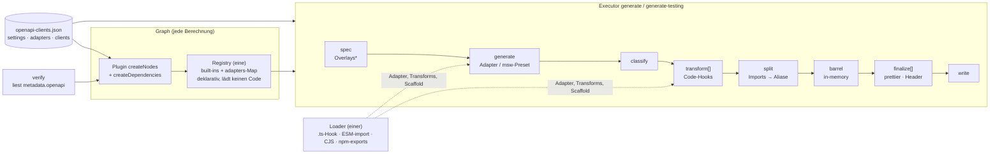

# OpenAPI-Tooling: Pipeline-Architektur

Zielarchitektur von `@mo-transfer/tooling-openapi` (Branch `feat/openapi-pipeline-architecture`) zur Freigabe. Umsetzung der Owner-Entscheidungen 1–8 + Feature-Flag für Overlays. Bedienung und Consumer-Guide: [`packages/tooling/openapi/README.md`](../packages/tooling/openapi/README.md), Einbettung in den Blueprint: [`docs/nx-umsetzung.md` → OpenAPI-Clients](nx-umsetzung.md#openapi-clients).

## Architektur

`*` Overlays nur mit `settings.features.overlays: true` (experimentell, Default aus).

| Baustein | Datei | Aufgabe |
|---|---|---|
| Settings | `src/settings.ts`, `openapi-clients.json → settings` | Workspace-Annahmen als Werte mit Defaults = heutige Werte: `libsDir`, `clientFolder`, `outputDir`, `aliasPrefix`, `sharedScope`, `specFiles`, `clientTags`, `partTags`, `header`, `scaffold`, `toolingInputs`, `features` |
| Config | `src/config.ts` | Typen + Lesen von `openapi-clients.json` (frisch pro Aufruf), Layout, Parts, Overlay-/Feature-Helfer |
| Registry | `src/registry/registry.ts` | **ein** Resolver: Built-ins (`openapi-tools`, `hey-api`, `nx-plugin-openapi`, `command`) + `adapters`-Map; liefert Modul-Referenz, Pakete, Inputs, Runtime, Optionen, Probleme. Kein Memo |
| Modul-Referenz / Loader | `src/registry/module-ref.ts`, `loader.ts`, `load.ts` | wohin ein Specifier zeigt + Cache-Inputs (leicht, im Plugin); Laden für Adapter, Transforms, Scaffold (`.ts` via eigenem Require-Hook, `.mjs`/ESM via echtem `import()`, CJS via `require`, npm-`exports` von Hand) + SPI-Prüfung |
| SPI v1 | `src/adapter.ts` (Export `./adapter`) | `defineAdapter`, `defineTransform`, `defineScaffold`, Kontext-Typen, `listTsFiles` |
| Contract-Test | `src/adapter-testing.ts` (Export `./adapter-testing`) | `runAdapterContract(adapter, { specFile })` über die echten Stages |
| Pipeline | `src/pipeline/runner.ts` + Stages | feste Reihenfolge, typisierter Kontext, Fehler mit Phase |
| Presets | `pipeline/client-preset.ts`, `testing-preset.ts` | `generate-api-client` (Adapter → types/api/core) und `generate-api-testing` (openapi-typescript + orval-msw + openapi-msw) auf demselben Runner |
| Plugin | `src/plugin/openapi-clients.ts` | `createNodes` (Nx 23): `generate-api-client` + `update-spec` am Client, `generate-api-testing` an der Testing-Lib, `metadata.openapi`; `createDependencies`: Client → `npm:<pkg>` |
| Generator | `src/generators/client` | Spec, `index.ts`, Client-`project.json`, Eintrag; Lib-Config über Scaffold (Default eingebaut, hier `@mo-transfer/tooling-conventions/openapi-scaffold`) |

## Entscheidungen + Begründung

| # | Entscheidung | Umsetzung | Begründung |
|---|---|---|---|
| 1 | Publishable Library | `build`-Target (tsc → `dist/packages/tooling/openapi`, CJS + `.d.ts`), `scripts/prepare-dist.mts` schreibt `package.json` (Exports `.js` + `types`, ohne `private`/devDependencies), `peerDependencies` nx/@nx/devkit/typescript, `dependencies` yaml. `npm pack --dry-run` grün (124 Dateien, 92,7 kB) | Quellen bleiben im Workspace ohne Build ladbar (Nx/swc), dist für npm |
| 1 | Settings-Ort: `openapi-clients.json → settings` | Defaults = heutige Werte, `json`-Feld `settings` ist Input jedes Generate-Targets | Executoren, Generator, verify lesen sie zur Laufzeit (Plugin-Optionen sehen sie nicht); jede `nx.json`-Änderung invalidiert den ganzen Cache. In `nx.json` (Plugin-Optionen) nur Graph-Form: Target-Namen |
| 1 | Keine Abhängigkeit auf tooling-conventions | eigene Pfad-/Tree-Helfer parametrisiert über Settings; Lib-Config per **Scaffold-SPI** (`settings.scaffold`), hier `@mo-transfer/tooling-conventions/openapi-scaffold` (strukturell, ohne Import des openapi-Pakets) | Lib-Konventionen (ng-packagr, tsconfig*, Tags) sind Workspace-Sache. ESLint erzwingt es: tooling-openapi ist buildable, Import nicht-buildable Libs blockiert |
| 1 | Tooling als Cache-Input | `toolingInputs: auto` → im Workspace Globs der Quellen, unter `node_modules` `externalDependencies: [<paket>]`, außerhalb (Fixture) keine | Kein hartcodierter `packages/tooling/openapi`-Pfad mehr |
| 2 | Alles TypeScript strict | Spike übernommen; Build-Skript `.mts` per Node-Type-Stripping | — |
| 3 | Consumer-Adapter | `adapters`-Map (Workspace-Pfad, npm-Paket inkl. ESM-only, `builtin:<id>`-Alias mit eigenen Defaults), deklarativ `packages`/`inputs`/`runtime`/`options`; Cache-Inputs: Modul-Ordner bzw. Paket + Kante → `npm:<pkg>`; `apiVersion`/`id` geprüft, Optionen gegen `optionsSchema` vor `generate`, `requires` (Pakete, Node) | Plugin importiert nie Adapter-Code (Graph schnell + robust); eine Registry statt zwei Kopien (Spike-Problem) |
| 3 | `.ts`-Adapter laden | eigener Require-Hook (TypeScript `transpileModule` → CJS) für `.ts` außerhalb `node_modules`, einmal installiert und behalten; ESM per Function-erzeugtem `import()` (Fallback `vm`-Main-Loader in Vitest) | Nx entfernt seinen swc-Hook nach dem Laden des Executors und macht aus `import()` ein `require()` (Spike-Befund). Getestet: `.ts`-Workspace-Adapter mit Helfer + SPI-Import, ESM-only Fake-npm-Paket, `.mjs`, CJS, TLA |
| 3 | Schema | `adapter`: `anyOf` (Built-in-`enum` ∪ Pattern) → Autocomplete + eigene IDs | — |
| 4 | Pipeline | `spec[] → generate → classify → transform[] → split → barrel → finalize[] → write`, Datei-Liste sortiert, Barrel aus In-Memory-Dateien (Compiler-Host), nur generate/write auf Platte | Determinismus, testbare Stages, ein Ort für Fehler |
| 4 | Overlays | OpenAPI Overlay 1.0, JSONPath-Teilmenge ohne Dependency, **hinter Feature-Flag** `settings.features.overlays` (Default aus). Aus + `pipeline.overlays` → Generate scheitert mit Hinweis, Plugin warnt, verify meldet (`metadata.openapi.disabledFeatures`); Overlay-Dateien nur mit Flag Cache-Input | Owner-Vorgabe: experimentell, nie stilles Ignorieren |
| 4 | Code-Hooks (`pipeline.transforms`) | Workspace-Modul/Paket via Loader, Modul-Ordner bzw. Paket = Cache-Input, `defineTransform`, Optionen per Schema | siehe Trade-off unten (Owner: bleibt aktiv) |
| 4 | `command`-Adapter | `command`/`args`/`env` mit Platzhaltern, Glob-Klassifizierung, `runtime` als Versions-Input | NSwag, Skripte, Docker ohne JS |
| 4 | Fehler | `OpenApiError` mit `phase`, `client`, `adapter`, `hint`, `cause`; Executor druckt Ursachen-Kette, `--verbose` (Option oder `NX_VERBOSE_LOGGING`) streamt Generator-Output + Stages + Stack | — |
| 5 | Testing als zweites Preset | gleicher Runner (Overlays, Transforms, Format, Header gelten auch); `pipeline.testing: false` → Generator ohne Testing-Lib, kein Target; `generate-api-testing` inferiert, Teil-Libs + Kanten + `lint`/`typecheck`-`dependsOn` bleiben explizit | — |
| 5 | Mocks-Engine `schema-faker` (Default) | Port des Spikes `spike/testing-without-orval` als Engine des Testing-Presets: Spec-Walk → `get<Op>ResponseMock`/`get<Op>MockHandler` (gleiche Namen wie orval), Schemas als Daten, `mock-runtime.ts` (faker + msw). Auswahl `settings.testing.mocks` (Default `schema-faker`) bzw. `pipeline.testing: { mocks }`; `orval` deprecated, eine Iteration wählbar, nur dann Cache-Input. Alle 3 Clients umgestellt | 0 neue Deps, schneller (pet: 722 vs. 992 ms Nx-Task), kleinerer generierter Code; orval entfernbar |
| 5 | Runtime kopieren statt importieren | `mock-runtime.ts` pro Testing-Lib (gitignored), Quelle als Asset im Paket (nicht kompiliert, in dist kopiert) | Import aus dem Tooling-Paket: Boundary-Verstoß (Libs → Tooling verboten) + Paket-Einstieg im Browser-Bundle; gemeinsame Lib: workspace-spezifischer Ort, eigenes Projekt/Kanten. Kopie importiert nur msw + faker |
| 6 | Layout `merged-core` | `layout: 'merged-core'` → core-Dateien + -Entries in die api-Lib (relative Imports bleiben), Generator ohne core-Lib, Outputs/Inputs/Kanten ohne core, verify kennt es, move/rename/remove tragen den Eintrag mit | einzige Variante neben types/api/core |
| 7 | `createNodes` (Nx 23) | `createNodesV2` entfernt; Optionen `clientTargetName`, `testingTargetName`, `updateSpecTargetName` (Generator liest sie aus `nx.json` für `dependsOn`) | — |
| 8 | Target-Namen | `generate-api-client`, `generate-api-testing`, `update-spec` unverändert (Defaults) | — |

### Trade-off Code-Hooks (Veto möglich)

| | |
|---|---|
| Gewinn | Nachbearbeitung ohne eigenen Adapter (Header-Kommentare, Umbenennungen, Patches für Generator-Bugs), für beide Presets |
| Risiko Determinismus | ein Hook kann Uhrzeit, Env, Netz, Dateien außerhalb seines Ordners lesen — das sieht der Cache nicht: gleicher Hash, anderer Output (**Cache-Poisoning**), auch über Remote-Cache |
| Risiko Wartung | Hooks hängen am Roh-Output eines Generators; ein Generator-Update kann sie still brechen |
| Absicherung | Modul-Ordner/Paket ist Cache-Input, Optionen schema-geprüft, Kopien der Dateien (kein halber Zustand), Duplikate/ungültige Parts → Fehler, Doku „muss deterministisch sein“ |
| Alternative | nur deklarative Transforms (Regex-Replace aus JSON) oder eigener Adapter, der den Built-in wrappt |

## orval vs. schema-faker (Spike-Messung, pet-client)

| | orval | schema-faker |
|---|---|---|
| Generierung kalt / warm | ~690 ms / 45 ms | **~425 ms / 14 ms** |
| Nx-Task `generate-api-testing` | 992 ms | **722 ms** |
| Output pet / notification / booking | 23 Dateien 80,6 KiB / 10 · 9,8 KiB / 9 · 6,9 KiB | **7 · 60,9 KiB** / 7 · 18,1 KiB / 7 · 15,8 KiB (inkl. 9,7 KiB Runtime-Kopie) |
| Browser-Bundle generierter Code (min) | 11,2 KiB | **6,9 KiB** |
| Testlaufzeit `shared-data-access:test` | ~1,27 s | ~1,2–1,3 s (Rauschen) |
| Abhängigkeiten | orval + 15 `@orval/*` | **0 neue** |
| Grenzen | – | nur lokale `$ref`s, nie `null`, `default`/`not`/`if`/`patternProperties`/`prefixItems` ignoriert, keine orval-Inline-Typen, gleicher Seed ≠ gleiche Werte wie orval |

Verworfene Alternativen (Spike): hey-api-Faker/msw-Plugins (ignoriert `example`, 501-Defaults), kubb/`@mswjs/source` (msw 3 nicht im Peer-Range), `msw-auto-mock` (AI-SDK-Deps), `openapi-backend`/Prism/Scalar (kein faker bzw. kein msw). Testing-Output ändert sich gegenüber main bewusst (andere Dateien/Werte), generierter Client-Code bleibt byte-identisch.

## Limitierungen

| Limitierung | Umgang |
|---|---|
| Adapter müssen **getrennte `.ts`-Dateien** liefern; eine Single-File-Ausgabe wird nicht aufgeteilt | alles in eine Kategorie (z. B. `apis`) oder Generator auf Split-Modus stellen |
| JSONPath nur Teilmenge (Namen, `*`, Index, `..`, Filter `==`/`!=`/Existenz) | unbekannte Syntax → Fehler, nie stiller Mismatch |
| `.ts`-Module: kein Typcheck beim Laden, keine tsconfig-`paths`, `.mts` nicht unterstützt | `.ts`/`.mjs`/`.js` nutzen; SPI per Paketname importieren |
| Workspace-Adapter: der ganze Ordner ist Input | ein Ordner pro Adapter |
| `node_modules`-Auflösung von npm-Adaptern ab Workspace-Root, Conditions `node`/`require`/`import`/`default` | — |
| Projektnamen-Regel `/` → `-` und Part-Ordner `types`/`api`/`core`/`testing` sind fest | dokumentiert |
| ESM-Import in Vitest nutzt `vm.USE_MAIN_CONTEXT_DEFAULT_LOADER` (experimentell, nur Fallback) | in Nx-Executoren nicht genutzt |
| Datei-Name `openapi-clients.json` fest (Plugin-Glob ist statisch) | — |
| schema-faker: nur lokale `$ref`s (externe Refs → Fehler beim Generieren) | Spec vorher bündeln (z. B. `@redocly/cli bundle`); Bündeln im spec-Stage ist eine mögliche Erweiterung |

## Migration (main → Branch)

- `openapi-clients.json`: neu `settings.scaffold: "@mo-transfer/tooling-conventions/openapi-scaffold"` (sonst schreibt der Generator nur project.json + tsconfig.json).
- Testing-`project.json` der drei Clients: `generate-api-testing` entfernt (Plugin). `lint`/`typecheck`-`dependsOn` bleiben.
- Inputs der Generate-Targets geändert (Tooling-Globs neu, `settings`-Feld, Testing mit `clients.<pfad>.pipeline`): einmalig laufen Clients und Abhängige neu.
- Exporte: `.` → `src/index.ts`, neu `./adapter`, `./adapter-testing`; tsconfig-`paths` nachgezogen. `adapterRegistry`/`adapterOf`/`clientTargets` entfallen (→ `resolveAdapterRegistry`, `inferClientTargets`).
- Fehlertexte der Executoren jetzt `[openapi:<phase>] <client> (adapter <id>): …` + `hint`.
- `verify-nx-internals`: dist-Snapshot ohne `dist/packages/**` (Tooling-dist ändert sich mit jedem Commit); Snapshot selbst unverändert (526 Dateien identisch).
- Generierter Client-Code (types/api/core) aller drei Clients **byte-identisch** zu main (50 Dateien, sha256). Testing-Libs bewusst geändert: `schema-faker` statt orval (7 statt 9–23 Dateien je Lib, `model.ts` statt `model/**`, `mock-runtime.ts`); Exporte gleich, Specs unverändert grün.

## Vorher / nachher

| | main | Branch |
|---|---|---|
| Code `src/` (ohne Specs) | 1 328 Zeilen (JS/MJS/TS gemischt) | 3 674 Zeilen TS strict |
| Specs | 1 791 Zeilen, 97 Tests | ~3 700 Zeilen, 186 Tests |
| Coverage (Stmts/Branches/Funcs/Lines) | 100 / 98,4 / 100 / 100 | 99,5 / 96,8 / 99,7 / 99,9 |
| Testing-Mocks | orval (+15 `@orval/*`) | schema-faker (0 Deps), orval deprecated |
| Erweiterungspunkte | Adapter nur im Paket (Modul + `registry.json` + 2 Schema-Enums) | Adapter (Workspace/npm/Built-in-Alias), Transform-Hooks, Overlays (Flag), Format, Scaffold, Target-Namen, Settings |
| Neuer Generator | Paket ändern: Modul, `registry.json`, `adapters/index.ts`, 2 Schemas, Release | Consumer: `defineAdapter` in einer Datei + 1 Zeile `adapters` (oder `command` ohne JS), Contract-Test via `runAdapterContract` |
| Wiederverwendung | nur dieser Workspace | npm-Paket, Workspace-Annahmen per Settings |
| Laden | statische Built-ins, `.ts` zur Laufzeit unmöglich | Loader für `.ts`/ESM/CJS/npm |

Mehr Code vor allem durch Loader, Registry-Validierung, JSONPath/Overlay, Contract-Helper und Settings — jeweils mit eigenen Tests.

## Offene Punkte für den Owner

1. Code-Hooks behalten (aktuell aktiv) oder auf deklarative Transforms beschränken?
2. Overlays aus dem Experimentalstatus holen, wann?
3. Paketname/Scope für npm (`@mo-transfer/tooling-openapi` vs. neutral), Registry, Lizenz, `nx release`-Konfiguration (Version, Changelog) — Build + `npm pack` sind bereit, `publishConfig`/Registry fehlen bewusst.
